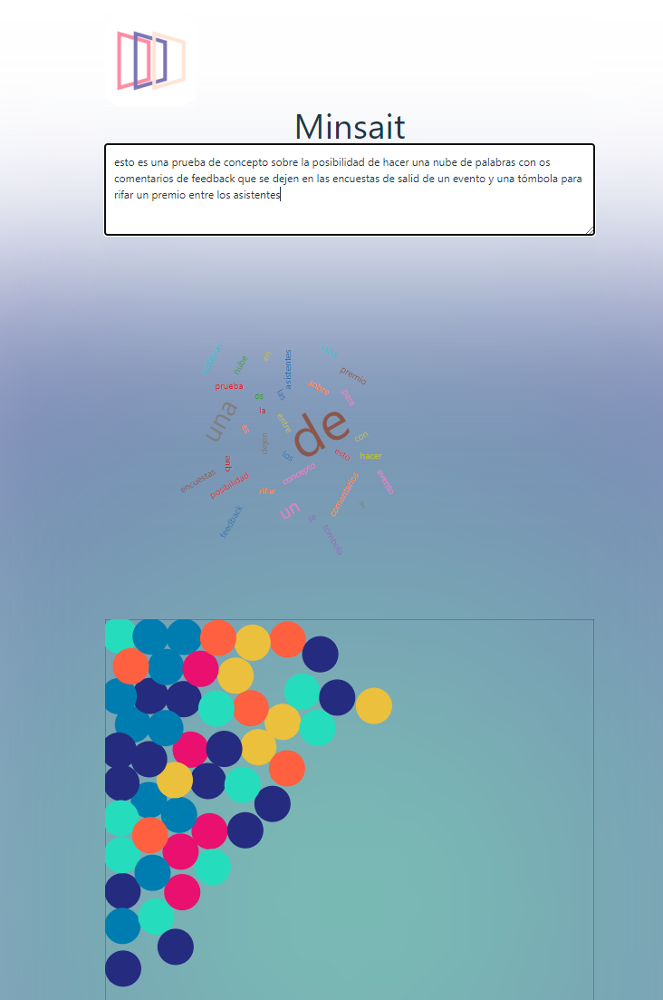

# Vue 3 + Vite tómbola

Esta es una demo que murió por inanición que pretendía ser para una dinámica de evento para recoger feedback y hacer una rifa con quienes fueran llenando las encuestas

## Recommended IDE Setup

- [VS Code](https://code.visualstudio.com/) + [Volar](https://marketplace.visualstudio.com/items?itemName=Vue.volar) (and disable Vetur) + [TypeScript Vue Plugin (Volar)](https://marketplace.visualstudio.com/items?itemName=Vue.vscode-typescript-vue-plugin).

